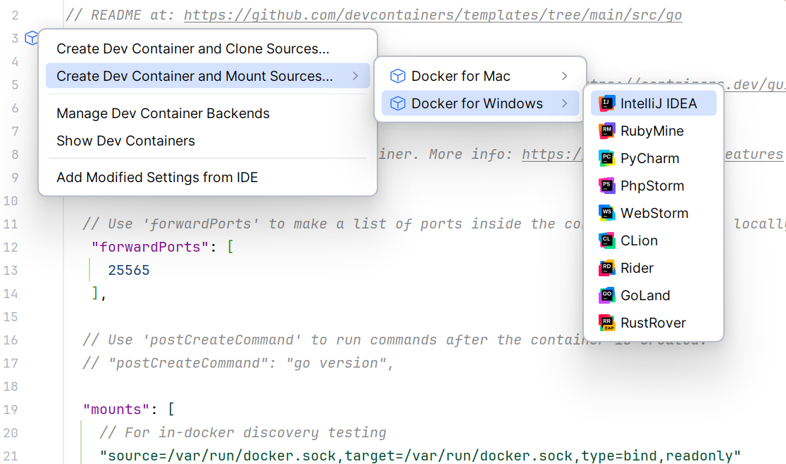
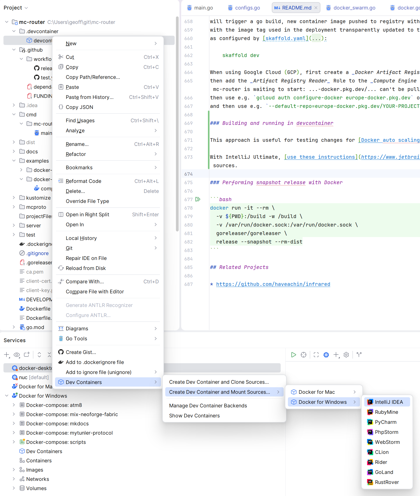

## Developing Docker discovery on non-Linux

This works best with the included devcontaner setup, which includes attaching the host's docker socket to the dev container at `/var/run/docker.sock`.

On Windows, can create the devcontainer using:



Within the devcontainer, start the vanilla example server with:

```shell
docker compose -f examples/docker-discovery/compose.yml run vanilla
```

Start mc-router directly in the devcontainer.

## Using skaffold


For "in-cluster development" it's convenient to use https://skaffold.dev. Any changes to Go source code
will trigger a go build, new container image pushed to registry with a new tag, and refresh in Kubernetes
with the image tag used in the deployment transparently updated to the new tag and thus new pod created pulling new images,
as configured by [skaffold.yaml](skaffold.yaml):


```shell
skaffold dev --kube-context=docker-desktop --default-repo=gcr.io/YOURS
```

- `YOURS` with your github username or the repo entirely

Verified with skaffold v2.23.0

Also be sure to kubectl apply the minecraft deployment such as `docs/k8s-mc-deployment.yaml` or `docs/k8s-mc-sts.yaml`, if using autoscaling.

> [!NOTE]
> The dev image build performed by skaffold uses [ko](https://skaffold.dev/docs/builders/builder-types/ko/), which 
> does not use the `Dockerfile` in the repo; however, the base image is [the same](https://github.com/chainguard-images/images/tree/main/images/static).

    skaffold dev

> [!TIP]
> When using Google Cloud (GCP), first create a _Docker Artifact Registry_,
> then add the _Artifact Registry Reader_ Role to the _Compute Engine default service account_ of your _GKE `clusterService` Account_ (to avoid error like "container mc-router is waiting to start: ...-docker.pkg.dev/... can't be pulled"),
> then use e.g. `gcloud auth configure-docker europe-docker.pkg.dev` or equivalent one time (to create a `~/.docker/config.json`),
> and then use e.g. `--default-repo=europe-docker.pkg.dev/YOUR-PROJECT/YOUR-ARTIFACT-REGISTRY` option for `skaffold dev`.


## Manual test cases

### Docker discovery with auto-scaling

1. Build the image given `Dockerfile` and tag it as `itzg/mc-router`
2. Start examples/docker-autoscale-multi/compose.yml
3. Wait for initial scale down of vanilla container
4. With Minecraft client, do a ping/list and ensure asleep MOTD comes back
   - Nothing happens with scaling or timer
5. Connect
   - Watch for scaling up of vanilla container
   - Client should fully connect after vanilla container is up
6. Stay connected longer than the 1 minute scale down timer
   - Ensure vanilla container is still up
7. Disconnect
8. Server list refresh to cause ping
   - ensure scale-down timer started again
9. Wait for scale down of vanilla container

## Confirming golreaser build

```shell
goreleaser release --snapshot --clean
```

### Performing snapshot release with Docker

```bash
docker run -it --rm \
  -v ${PWD}:/build -w /build \
  -v /var/run/docker.sock:/var/run/docker.sock \
  goreleaser/goreleaser \
  release --snapshot --clean
```

## Building locally with Docker

```bash
docker build -t mc-router .
```

## Build locally without Docker

After [installing Go](https://go.dev/doc/install) and doing a `go mod download` to install all required prerequisites, just like the [Dockerfile](Dockerfile) does, you can:

```bash
make test # go test -v ./...
go build ./cmd/mc-router/
```

## Running in devcontainer

This approach is useful for testing changes for [Docker auto scaling](#docker-auto-scale-updown).

With IntelliJ Ultimate, [use these instructions](https://www.jetbrains.com/help/idea/start-dev-container-inside-ide.html). It is recommended to use the option to mount sources.



Use the example compose file [in examples/docker-discovery](examples/docker-discovery/compose.yml) or similar with `network_mode` set to "bridge" to ensure that the mc-router instance running within the devcontainer can reach the backend servers.

When applying the `mc-router.host` label to containers to be auto-discovered, it's easiest to use an external host of "localhost":

```yaml
  vanilla:
    image: itzg/minecraft-server
    environment:
      EULA: "TRUE"
    labels:
      mc-router.host: "localhost"
```

Run one of the labeled services by clicking the run icon in the gutter.

## Docker Swarm

In order to make development images available to the mc-router service, you need to run an in-cluster retry and push to it.

Start an in-cluster retry service:

```shell
docker service create \
  --name registry \
  --publish published=5000,target=5000 \
  registry:2
```

Build the image like normal and tag it as `localhost:5000/itzg/mc-router:r1` using the tag as a distinct version to test.

```shell
docker tag itzg/mc-router:latest localhost:5000/itzg/mc-router:r1
```

Finally, push the image to the in-cluster retry service:

```shell
docker push localhost:5000/itzg/mc-router:r1
```

Be sure to update the `image` in the stack's compose file, such as

```yaml
  router:
     image: 127.0.0.1:5000/itzg/mc-router:r1
     environment:
        IN_DOCKER_SWARM: "true"
```