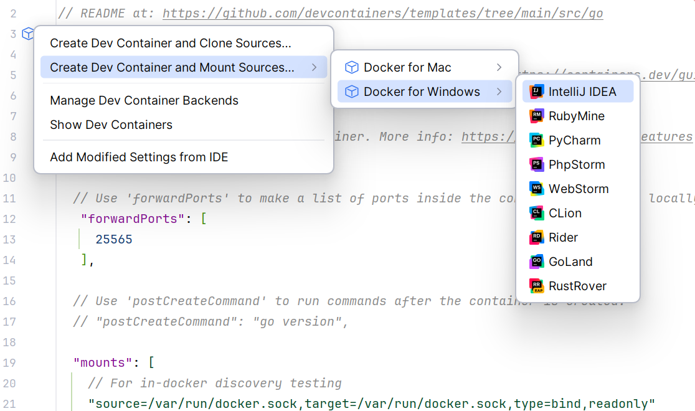

## Developing Docker discovery on non-Linux

This works best with the included devcontaner setup, which includes attaching the host's docker socket to the dev container at `/var/run/docker.sock`.

On Windows, can create the devcontainer using:

