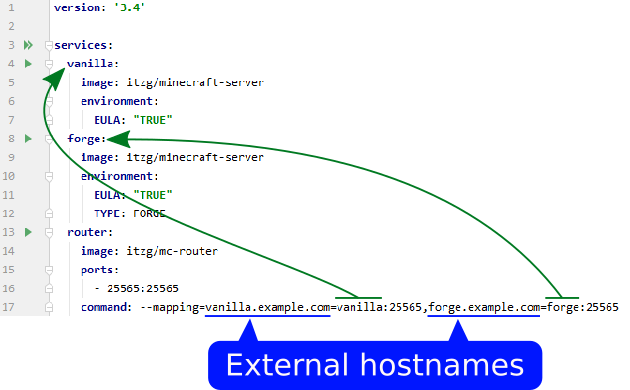

[](https://github.com/itzg/mc-router/issues)
[](https://cloud.docker.com/u/itzg/repository/docker/itzg/mc-router)
[](https://github.com/itzg/mc-router/actions/workflows/test.yml)
[](https://github.com/itzg/mc-router/releases)
[](https://discord.gg/JK2v3rJ9ec)
[](https://www.buymeacoffee.com/itzg)

Routes Minecraft client connections to backend servers based upon the requested server address.

## Usage

```text
  -api-binding host:port
    	The host:port bound for servicing API requests (env API_BINDING)
  -auto-scale-up
    	Increase Kubernetes StatefulSet Replicas (only) from 0 to 1 on respective backend servers when accessed (env AUTO_SCALE_UP)
  -auto-scale-down
      Decrease Kubernetes StatefulSet Replicas (only) from 1 to 0 after all backend connections have stopped and a configurable amount of delay has passed (env AUTO_SCALE_DOWN)
  -auto-scale-down-after
      String indicating how long an auto scale down should wait before scaling down a backend server. If a player rejoins the server during this delay, the scale down will be canceled (env AUTO_SCALE_DOWN_AFTER)
  -auto-scale-allow-deny string
      Path to config for server allowlists and denylists. If a global/server entry is specified, only players allowed to connect to the server will be able to trigger a scale up when -auto-scale-up is enabled or cancel active down scalers when -auto-scale-down is enabled (env AUTO_SCALE_ALLOW_DENY)
  -clients-to-allow value
    	Zero or more client IP addresses or CIDRs to allow. Takes precedence over deny. (env CLIENTS_TO_ALLOW)
  -clients-to-deny value
    	Zero or more client IP addresses or CIDRs to deny. Ignored if any configured to allow (env CLIENTS_TO_DENY)
  -connection-rate-limit int
    	Max number of connections to allow per second (env CONNECTION_RATE_LIMIT) (default 1)
  -cpu-profile string
    	Enables CPU profiling and writes to given path (env CPU_PROFILE)
  -debug
    	Enable debug logs (env DEBUG)
  -default string
    	host:port of a default Minecraft server to use when mapping not found (env DEFAULT)
  -docker-refresh-interval int
    	Refresh interval in seconds for the Docker integrations (env DOCKER_REFRESH_INTERVAL) (default 15)
  -docker-socket string
    	Path to Docker socket to use (env DOCKER_SOCKET) (default "unix:///var/run/docker.sock")
  -docker-timeout int
    	Timeout configuration in seconds for the Docker integrations (env DOCKER_TIMEOUT)
  -in-docker
    	Use Docker service discovery (env IN_DOCKER)
  -in-docker-swarm
    	Use Docker Swarm service discovery (env IN_DOCKER_SWARM)
  -in-kube-cluster
    	Use in-cluster Kubernetes config (env IN_KUBE_CLUSTER)
  -kube-config string
    	The path to a Kubernetes configuration file (env KUBE_CONFIG)
  -kube-namespace string
    	The namespace to watch or blank for all, which is the default (env KUBE_NAMESPACE)
  -mapping value
    	Comma or newline delimited or repeated mappings of externalHostname=host:port (env MAPPING)
  -metrics-backend string
    	Backend to use for metrics exposure/publishing: discard,expvar,influxdb,prometheus (env METRICS_BACKEND) (default "discard")
  -metrics-backend-config-influxdb-addr string
    	 (env METRICS_BACKEND_CONFIG_INFLUXDB_ADDR)
  -metrics-backend-config-influxdb-database string
    	 (env METRICS_BACKEND_CONFIG_INFLUXDB_DATABASE)
  -metrics-backend-config-influxdb-interval duration
    	 (env METRICS_BACKEND_CONFIG_INFLUXDB_INTERVAL) (default 1m0s)
  -metrics-backend-config-influxdb-password string
    	 (env METRICS_BACKEND_CONFIG_INFLUXDB_PASSWORD)
  -metrics-backend-config-influxdb-retention-policy string
    	 (env METRICS_BACKEND_CONFIG_INFLUXDB_RETENTION_POLICY)
  -metrics-backend-config-influxdb-tags value
    	any extra tags to be included with all reported metrics (env METRICS_BACKEND_CONFIG_INFLUXDB_TAGS)
  -metrics-backend-config-influxdb-username string
    	 (env METRICS_BACKEND_CONFIG_INFLUXDB_USERNAME)
  -ngrok-remote-addr string
    	If set, the TCP address to request for this edge (env NGROK_REMOTE_ADDR)
  -ngrok-token string
    	If set, an ngrok tunnel will be established. It is HIGHLY recommended to pass as an environment variable. (env NGROK_TOKEN)
  -port port
    	The port bound to listen for Minecraft client connections (env PORT) (default 25565)
  -receive-proxy-protocol
    	Receive PROXY protocol from backend servers, by default trusts every proxy header that it receives, combine with -trusted-proxies to specify a list of trusted proxies (env RECEIVE_PROXY_PROTOCOL)
  -routes-config path
    	Name or full path to routes config file (env ROUTES_CONFIG)
  -routes-config-watch
    	Watch for config file changes (env ROUTES_CONFIG_WATCH)
  -simplify-srv
    	Simplify fully qualified SRV records for mapping (env SIMPLIFY_SRV)
  -trusted-proxies value
    	Comma delimited list of CIDR notation IP blocks to trust when receiving PROXY protocol (env TRUSTED_PROXIES)
  -use-proxy-protocol
    	Send PROXY protocol to backend servers (env USE_PROXY_PROTOCOL)
  -version
    	Output version and exit (env VERSION)
  -webhook-require-user
    	Indicates if the webhook will only be called if a user is connecting rather than just server list/ping (env WEBHOOK_REQUIRE_USER)
  -webhook-url string
    	If set, a POST request that contains connection status notifications will be sent to this HTTP address (env WEBHOOK_URL)
  -record-logins
      Log and generate metrics on player logins. Metrics only supported with influxdb or prometheus backend (env RECORD_LOGINS)
```

## Docker Multi-Architecture Image

The [multi-architecture image published at Docker Hub](https://hub.docker.com/repository/docker/itzg/mc-router) supports amd64, arm64, and arm32v6 (i.e. RaspberryPi).

## Docker Compose Usage

The diagram below shows how this `docker-compose.yml` configures two Minecraft server services named `vanilla` and `forge`, which also become the internal network aliases. _Notice those services don't need their ports exposed since the internal networking allows for the inter-container access._

```yaml
services:
  vanilla:
    image: itzg/minecraft-server
    environment:
      EULA: "TRUE"
  forge:
    image: itzg/minecraft-server
    environment:
      EULA: "TRUE"
      TYPE: FORGE
  router:
    image: ${MC_ROUTER_IMAGE:-itzg/mc-router}
    depends_on:
      - forge
      - vanilla
    environment:
      MAPPING: |
        vanilla.example.com=vanilla:25565
        forge.example.com=forge:25565
    ports:
      - "25565:25565"
```

The `router` service is only one of the services that needs to exposed on the external network. The `MAPPING` declares how the hostname users will enter into their Minecraft client will map to the internal services.



To test out this example, add these two entries to my "hosts" file:

```
127.0.0.1 vanilla.example.com
127.0.0.1 forge.example.com
```

### Using Docker auto-discovery

When running `mc-router` in a Docker environment you can pass the `--in-docker` or `--in-docker-swarm` command-line argument or set the environment variables `IN_DOCKER` or `IN_DOCKER_SWARM` to "true". With that, it will poll the Docker API periodically to find all the running containers/services for Minecraft instances. To enable discovery, you have to set the `mc-router.host` label on the container. 

When using in Docker, make sure to volume mount the Docker socket into the container, such as

```yaml
    volumes:
      - /var/run/docker.sock:/var/run/docker.sock:ro
```

These are the labels scanned:

- `mc-router.host`: Used to configure the hostname the Minecraft clients would use to connect to the server. The container/service endpoint will be used as the routed backend. You can use more than one hostname by splitting it with a comma.
- `mc-router.port`: This value must be set to the port the Minecraft server is listening on. The default value is 25565.
- `mc-router.default`: Set this to a truthy value to make this server the default backend. Please note that `mc-router.host` is still required to be set.
- `mc-router.network`: Specify the network you are using for the router if multiple are present in the container/service. You can either use the network ID, it's full name or an alias.

#### Example Docker deployment

Refer to [this example docker-compose.yml](docs/sd-docker.docker-compose.yml) to see how to
configure two different Minecraft servers and a `mc-router` instance for use with Docker service discovery.

#### Example Docker Swarm deployment

Refer to [this example docker-compose.yml](docs/swarm.docker-compose.yml) to see how to
configure two different Minecraft servers and a `mc-router` instance for use with Docker Swarm service discovery.

## Routing Configuration

The routing configuration allows routing via a config file rather than a command. 
You need to set `-routes-config` or `ROUTES_CONFIG` env variable.
The following shows a JSON file for routes config, where `default-server` can also be `null` or omitted:

```json
{
  "default-server": "vanilla:25565",
  "mappings": {
    "vanilla.example.com": "vanilla:25565",
    "forge.example.com": "forge:25565"
  }
}
```

Sending a SIGHUP signal will cause mc-router to reload the routes config from disk. The file can also be watched for changes by setting `-routes-config-watch` or the env variable `ROUTES_CONFIG_WATCH` to "true".

## Auto Scale Allow/Deny List

The allow/deny list configuration allows limiting which players can scale up servers when using the `-auto-scale-up` option (`AUTO_SCALE_UP` env variable) and which players can cancel an active down scaler when using the `-auto-scale-down` option (`AUTO_SCALE_DOWN` env variable). Global allow/deny lists can be configured that apply to all backend servers, but server-specific lists can be added as well. There are a few important things to note about the configuration:
- The `mc-router` process will not automatically pick up changes to the config. If updates to the config are made, the router must be restarted.
- Allowlists always take priority over denylists. This means if a player is included in a sever-specific allowlist and the global denylist, the player will still be considered allowed on that server. If a player is listed in both a global allowlist and denylist, the denylist entry will be ignored.
- Player entries only require a `uuid` or `name`. Both will be checked if specified, but otherwise a `uuid` will take priority over a `name`.

An example configuration might look something like:

```json
{
  "global": {
    "denylist": [
      {"uuid": "<some player's uuid>", "name": "<some player's name>"}
    ]
  },
  "servers": {
    "my.server.domain": {
      "allowlist": [
        {"uuid": "<some player's uuid>"}
      ]
    },
    "my.other-server.domain": {
      "denylist": [
        {"uuid": "<some player's uuid>"}
      ]
    }
  }
}
```

In the example, players in the `my.server.domain` allowlist will be able to scale up `my.server.domain`. Players in the global denylist and the `my.other-server.domain` denylist will **not** be able to scale up `my.other-server.domain`. Any servers not listed in the config will also be affected by the global allowlist. Note that if a global allowlist is specified, no denylists will have any effect as that global allowlist will affect all servers.

For more information on the allow/deny list configuration, see the [json schema](docs/allow-deny-list.schema.json).

## Kubernetes Usage

### Using Kubernetes Service auto-discovery

When running `mc-router` as a Kubernetes Pod and you pass the `--in-kube-cluster` command-line argument, then it will automatically watch for any services annotated with
- `mc-router.itzg.me/externalServerName` : The value of the annotation will be registered as the external hostname Minecraft clients would used to connect to the routed service. The service is used as the routed backend. You can use more hostnames by splitting them with comma.
- `mc-router.itzg.me/defaultServer` : The service is used as the default if no other `externalServiceName` annotations applies.

By default, the router will watch all namespaces for those services; however, a specific namespace can be specified using the `KUBE_NAMESPACE` environment variable. The pod's own namespace could be set using:

```yaml
     - name: KUBE_NAMESPACE
       valueFrom:
         fieldRef:
           fieldPath: metadata.namespace
```

For example, start `mc-router`'s container spec with

```yaml
image: itzg/mc-router
name: mc-router
args: ["--in-kube-cluster"]
```

and configure the backend minecraft server's service with the annotation:

```yaml
apiVersion: v1
kind: Service
metadata:
  name: mc-forge
  annotations:
    "mc-router.itzg.me/externalServerName": "external.host.name"
```

you can use multiple host names:

```yaml
apiVersion: v1
kind: Service
metadata:
  name: mc-forge
  annotations:
    "mc-router.itzg.me/externalServerName": "external.host.name,other.host.name"
```

The `Role` or `ClusterRole` bound to the service account should have the rules:

```yaml
rules:
  - apiGroups: [""]
    resources: ["services"]
    verbs: ["watch","list"]
```

and if using StatefulSet auto-scaling additionally

```yaml
  - apiGroups: ["apps"]
    resources: ["statefulsets"]
    verbs: ["watch","list","get","update"]
  - apiGroups: ["apps"]
    resources: ["statefulsets/scale"]
    verbs: ["get","update"]
```

### Service parsing

To detrmine the endpoint mc-router will pick the host from `spec.clusterIP` by default, if the service is of type `ExtenalName` it will use `spec.externalName` instead.

For the port it will look in `spec.ports` for a port named `mc-router`, if not present `minecraft` or, if neither port names exist, it will use default minecraft port value 25565.

### Example Kubernetes deployment

[This example deployment](docs/k8s-example-auto.yaml)
* Declares an `mc-router` service that exposes a node port 25565
* Declares a service account with access to watch and list services
* Declares `--in-kube-cluster` in the `mc-router` container arguments
* Two "backend" Minecraft servers are declared each with an
  `"mc-router.itzg.me/externalServerName"` annotation that declares their external server name(s)

```bash
kubectl apply -f https://raw.githubusercontent.com/itzg/mc-router/master/docs/k8s-example-auto.yaml
```


##### Notes
* This deployment assumes two persistent volume claims: `mc-stable` and `mc-snapshot`
* I extended the allowed node port range by adding `--service-node-port-range=25000-32767`
  to `/etc/kubernetes/manifests/kube-apiserver.yaml`

##### Auto Scale Up/Down

The `-auto-scale-up` flag argument makes the router "wake up" any stopped backend servers by changing `replicas: 0` to `replicas: 1`. The `-auto-scale-down` flag argument makes the router shut down any running backend servers with no active connections by changing `replicas: 1` to `replicas: 0`. The scale down will occur after a configurable (using the `-auto-scale-down-after` argument) waiting period, such as `10m` (10 minutes), `2h` (2 hours), etc. If any players connect to the server during this period the scale down will be canceled. It is recommended to set this value high enough so a temporary player disconnect will not immediately shut down the server (`1m` or higher).

Both options require using `kind: StatefulSet` instead of `kind: Service` for the Minecraft backend servers.

They also require the `ClusterRole` to permit `get` + `update` for `statefulsets` & `statefulsets/scale`,
e.g. like this (or some equivalent more fine-grained one to only watch/list services+statefulsets, and only get+update scale):

```yaml
apiVersion: rbac.authorization.k8s.io/v1
kind: ClusterRole
metadata:
  name: services-watcher
rules:
- apiGroups: [""]
  resources: ["services"]
  verbs: ["watch","list"]
- apiGroups: ["apps"]
  resources: ["statefulsets", "statefulsets/scale"]
  verbs: ["watch","list","get","update"]
```

Make sure to set `StatefulSet.metadata.name` and `StatefulSet.spec.serviceName` to the same value;
otherwise, autoscaling will not trigger:

```yaml
apiVersion: v1
kind: Service
metadata:
  name: mc-forge
  annotations:
    "mc-router.itzg.me/defaultServer": "true"
    "mc-router.itzg.me/externalServerName": "external.host.name"
spec:
  type: ClusterIP
---
apiVersion: apps/v1
kind: StatefulSet
metadata:
  name: mc-forge
spec:
  serviceName: mc-forge
  selector:
    matchLabels:
      app: mc-forge
  template:
    metadata:
      labels:
        app: mc-forge
    spec:
      containers:
        - name: mc
```

You can also opt-out of auto-scaling per server by setting the following annotations on the `Service` object:
- `mc-router.itzg.me/autoScaleUp=false`
- `mc-router.itzg.me/autoScaleDown=false`

Example server with auto-scaling disabled explicitly:
```yaml
apiVersion: v1
kind: Service
metadata:
  name: mc-forge
  annotations:
    "mc-router.itzg.me/externalServerName": "external.host.name"
    "mc-router.itzg.me/autoScaleUp": "false"
    "mc-router.itzg.me/autoScaleDown": "false"
```

## REST API

* `GET /routes` (with `Accept: application/json`)

  Retrieves the currently configured routes

* `POST /routes` (with `Content-Type: application/json`)

  Registers a route given a JSON body structured like:
  ```json
  {
    "serverAddress": "CLIENT REQUESTED SERVER ADDRESS",
    "backend": "HOST:PORT"
  }
  ```

* `POST /defaultRoute` (with `Content-Type: application/json`)

  Registers a default route to the given backend. JSON body is structured as:
  ```json
  {
    "backend": "HOST:PORT"
  }
  ```

* `DELETE /routes/{serverAddress}`

  Deletes an existing route for the given `serverAddress`

## ngrok

mc-router has built-in support to run as an [ngrok agent](https://ngrok.com/docs/secure-tunnels/ngrok-agent/). To enable this support, pass [an ngrok authtoken](https://ngrok.com/docs/secure-tunnels/ngrok-agent/tunnel-authtokens/#per-agent-authtokens) to the command-line argument or environment variable, [shown above](#usage).

### Ngrok Quick Start

Create/access an ngrok account and [allocate an agent authtoken from the dashboard](https://dashboard.ngrok.com/tunnels/authtokens).

In a new directory, create a file called `.env` with the allocated token

```dotenv
NGROK_TOKEN=...
```

In the same directory, create the following compose file:

```yaml
version: "3.8"

services:
  mc:
    image: itzg/minecraft-server
    environment:
      EULA: true
    volumes:
      - mc-data:/data
    # No port mapping since mc-router connects over compose network
  router:
    image: itzg/mc-router
    environment:
      DEFAULT: mc:25565
      NGROK_TOKEN: ${NGROK_TOKEN}
    # No port mapping needed since it routes through ngrok tunnel

volumes:
  mc-data: {}
```

Start the compose project:

```shell
docker compose up -d
```

Grab the mc-router logs using:

```shell
docker compose logs router
```

From those logs, locate the `ngrokUrl` parameter from the "Listening" info log message, such as `tcp://8.tcp.ngrok.io:99999`.

In the Minecraft client, the server address will be the part after the "tcp://" prefix, such as `8.tcp.ngrok.io:99999`.

## Webhook Support

Refer to [the usage section above](#usage) for `-webhook-*` argument descriptions.

### Sample connect event payloads

The following are sample payloads for the `connect` webhook events.

#### Successful player backend connection

```json
{
  "event": "connect",
  "timestamp": "2025-04-20T22:26:30.2568775-05:00",
  "status": "success",
  "client": {
    "host": "127.0.0.1",
    "port": 56860
  },
  "server": "localhost",
  "player": {
    "name": "itzg",
    "uuid": "5cddfd26-fc86-4981-b52e-c42bb10bfdef"
  },
  "backend": "localhost:25566"
}
```

**NOTE** `client` refers to the machine where the Minecraft client is connecting from and is conveyed separately from the `player` starting a session. As seen below, the player information may not always be present, such as when the client is pinging the server list.

#### Successful server ping backend connection

**NOTE** the absence of `player` in this payload since the Minecraft client does not send player information in the server ping request.

```json
{
  "event": "connect",
  "timestamp": "2025-04-20T22:26:30.2568775-05:00",
  "status": "success",
  "client": {
    "host": "127.0.0.1",
    "port": 56396
  },
  "server": "localhost",
  "backend": "localhost:25566"
}
```

#### Missing backend

In this the status is `"missing-backend"` since the requested server `invalid.example.com` does not have a configured/discovered backend entry.

```json
{
  "event": "connect",
  "timestamp": "2025-04-20T22:26:30.2568775-05:00",
  "status": "missing-backend",
  "client": {
    "host": "127.0.0.1",
    "port": 56891
  },
  "server": "invalid.example.com",
  "player": {
    "name": "itzg",
    "uuid": "5cddfd26-fc86-4981-b52e-c42bb10bfdef"
  },
  "error": "No backend found"
}
```

#### Failed backend connection

In this case the `status` is `"failed-backend-connection"` indicating that a backend server was located but a connection could not be established from mc-router.

```json
{
  "event": "connect",
  "timestamp": "2025-04-20T22:26:30.2568775-05:00",
  "status": "failed-backend-connection",
  "client": {
    "host": "127.0.0.1",
    "port": 56905
  },
  "server": "localhost",
  "player": {
    "name": "itzg",
    "uuid": "5cddfd26-fc86-4981-b52e-c42bb10bfdef"
  },
  "backend": "localhost:25566",
  "error": "dial tcp [::1]:25566: connectex: No connection could be made because the target machine actively refused it."
}
```

## Development

### Building locally with Docker

```bash
docker build -t mc-router .
```

### Build locally without Docker

After [installing Go](https://go.dev/doc/install) and doing a `go mod download` to install all required prerequisites, just like the [Dockerfile](Dockerfile) does, you can:

```bash
make test # go test -v ./...
go build ./cmd/mc-router/
```

### Skaffold

For "in-cluster development" it's convenient to use https://skaffold.dev. Any changes to Go source code
will trigger a go build, new container image pushed to registry with a new tag, and refresh in Kubernetes
with the image tag used in the deployment transparently updated to the new tag and thus new pod created pulling new images,
as configured by [skaffold.yaml](skaffold.yaml):

    skaffold dev

When using Google Cloud (GCP), first create a _Docker Artifact Registry_,
then add the _Artifact Registry Reader_ Role to the _Compute Engine default service account_ of your _GKE `clusterService` Account_ (to avoid error like "container mc-router is waiting to start: ...-docker.pkg.dev/... can't be pulled"),
then use e.g. `gcloud auth configure-docker europe-docker.pkg.dev` or equivalent one time (to create a `~/.docker/config.json`),
and then use e.g. `--default-repo=europe-docker.pkg.dev/YOUR-PROJECT/YOUR-ARTIFACT-REGISTRY` option for `skaffold dev`.

### Performing snapshot release with Docker

```bash
docker run -it --rm \
  -v ${PWD}:/build -w /build \
  -v /var/run/docker.sock:/var/run/docker.sock \
  goreleaser/goreleaser \
  release --snapshot --rm-dist
```

## Related Projects

* https://github.com/haveachin/infrared
