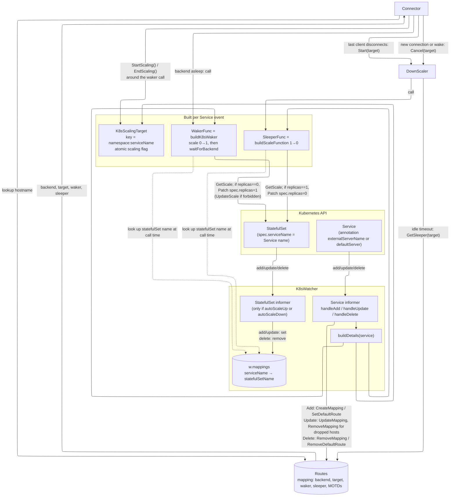

```mermaid
---
config:
  layout: elk
---
flowchart TD
  subgraph K8s["Kubernetes API"]
    SVC["Service<br/>(annotation externalServerName or defaultServer)"]
    STS["StatefulSet<br/>(spec.serviceName = Service name)"]
  end

  subgraph Watcher["K8sWatcher"]
    SI["Service informer<br/>handleAdd / handleUpdate / handleDelete"]
    TI["StatefulSet informer<br/>(only if autoScaleUp or autoScaleDown)"]
    MAP[("w.mappings<br/>serviceName → statefulSetName")]
    BD["buildDetails(service)"]
  end

  subgraph Built["Built per Service event"]
    ST["K8sScalingTarget<br/>key = namespace:serviceName<br/>atomic scaling flag"]
    WK["WakerFunc = buildK8sWaker<br/>scale 0→1, then waitForBackend"]
    SL["SleeperFunc = buildScaleFunction 1→0"]
  end

  R[("Routes<br/>mapping: backend, target, waker, sleeper, MOTDs")]
  CN["Connector"]
  DS["DownScaler"]

  SVC -->|add/update/delete| SI
  STS -->|add/update/delete| TI
  TI -->|"add/update: set<br/>delete: remove"| MAP
  SI --> BD --> ST & WK & SL
  SI -->|"Add: CreateMapping / SetDefaultRoute<br/>Update: UpdateMapping, RemoveMapping for dropped hosts<br/>Delete: RemoveMapping / RemoveDefaultRoute"| R

  CN -->|"lookup hostname"| R
  R -->|"backend, target, waker, sleeper"| CN
  CN -->|"StartScaling() / EndScaling()<br/>around the waker call"| ST
  CN -->|"backend asleep: call"| WK
  CN -->|"last client disconnects: Start(target)"| DS
  DS -->|"idle timeout: GetSleeper(target)"| R
  DS -->|"call"| SL
  CN -->|"new connection or wake: Cancel(target)"| DS

  WK -->|"GetScale; if replicas==0,<br/>Patch spec.replicas=1<br/>(UpdateScale if forbidden)"| STS
  SL -->|"GetScale; if replicas==1,<br/>Patch spec.replicas=0"| STS
  WK & SL -.->|"look up statefulSet name at call time"| MAP
```